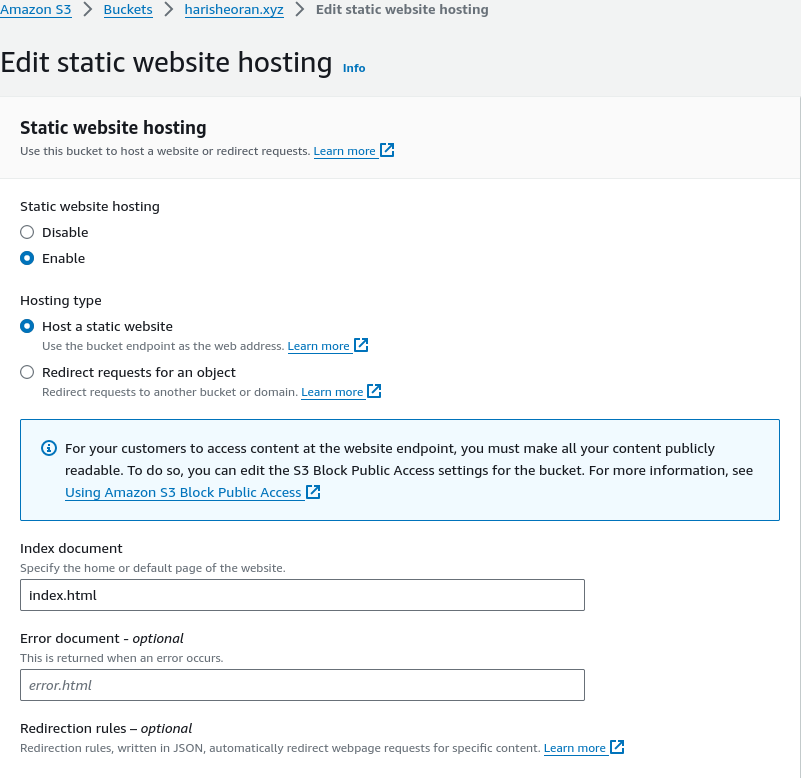
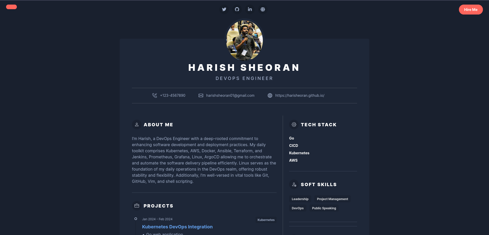
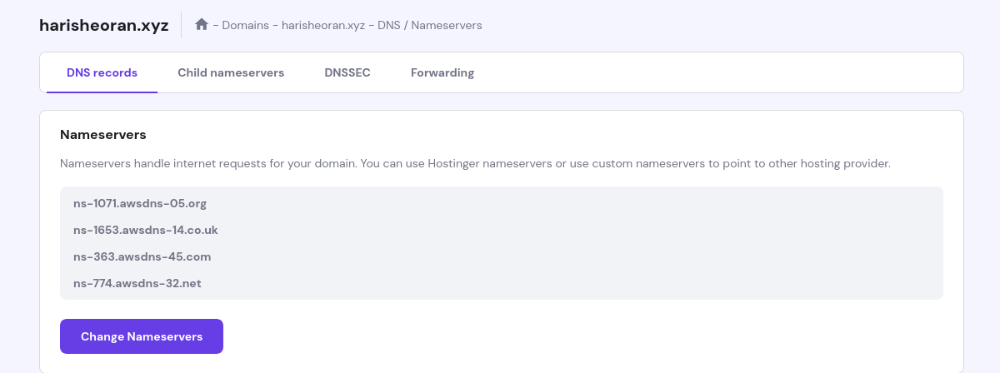

## AWS Cloud Resume

## Steps
- Website Code
- Buy Domain
- Create Route 53
- Create SSL Cert ACM


## Manual Steps
- Build a Resume Website in HTML, CSS, JS

> You can download [this](https://themes.3rdwavemedia.com/bootstrap-templates/resume/risen-free-bootstrap-5-dark-mode-resume-cv-template-for-developers/) Bootstrap website and change accordingly.

Here is my resume website code - [Github](https://github.com/harisheoran/AWS-Cloud-Resume/tree/main/website)

- Host it on S3 Bucket
    - Create a S3 Bucket as same name as you Domain Name
    - Remove check from ***Block Public Access***
    - Upload all the website files
    - Enable Static Website hosting
        - Go to ***Properties*** > ***Static website hosting***
        - Enable it & fill ***Index Document***
            
        - Go to the URL it has created, you will get 403 error

        WHY? What happens?
        - We need to allow to access S3 by defining Bucket Policy
        ```
        {
            "Version": "2012-10-17",
            "Statement": [
                {
                    "Sid": "AddPerm",
                    "Effect": "Allow",
                    "Principal": "*",
                    "Action": "s3:GetObject",
                    "Resource": "arn:aws:s3:::YOUR_BUCKET_NAME/*"
                }
            ]
        }
        ```

    - Now visit the Static website URL of S3 bucket, website is accessible now
    


> **Issue :** We unchecked the ***Block Public Access***, which makes the S3 bucket's content accessible to everyone even to hackers which is an security issue.

### Why do we need Cloudfront?
Now our website is puclicly accessible, why do we need the Cloudfront.


CloudFront is a Content Delivery Network(CDN) service also provided by AWS, it enables users to deliver content globally with low latency, high data transfer speed, and securely delivered.
leveraging AWS edge locations around the world to cache and deliver content from the nearest location to the user, reducing latency and improving performance.
It also offers features such as SSL/TLS encryption, access controls, and real-time metrics.

> **Issue :** Our Website is not secure, it is using ***http*** protocol


- First, check the ***Block Public Access*** on S3 bucket.

- Create a SSL certificate using *AWS Certificate Manager*, create this certificate in North Verginia region.
- Create a CNAME record for this certificate in Hosted Zone.

> ***Must Read*** :  [Understanding DNS and Amazon's Route 53 Cloud Service](https://dev.to/aws-builders/understanding-dns-and-amazons-route-53-cloud-service-a-beginners-introduction-4jkc)


- Create Cloudfront
Follow this [blog](https://blog.tericcabrel.com/host-static-website-aws-s3-cloudfront/) 
After creating the CDN, add the Bucket policy (CDN will provide you after creating it) to S3 bucket.

Now if you visit the CDN url, our resume website is live now.

but it is not using our Domain Name

### Route 53
- Create a Hosted Zone .
- Add the Nameservers of Hosted Zone to the Domain Provider Nameservers.
    

- Create a ***A Record*** in hosted zone for *Alias* to redirect the request from domain name to CDN URL.


---

#### Other refrence Blogs
[AWS Refrence for hosting simple static Website using S3](https://docs.aws.amazon.com/AmazonS3/latest/userguide/WebsiteHosting.html)

[DNS & Route 53](https://dev.to/aws-builders/understanding-dns-and-amazons-route-53-cloud-service-a-beginners-introduction-4jkc)

[Hosting Website](https://dev.to/aws-builders/guide-to-hosting-a-static-website-on-aws-using-s3-cloudfront-and-route53-with-just-7-steps-220b)

[Hosting Website with CDN OAI](https://blog.tericcabrel.com/host-static-website-aws-s3-cloudfront/)

[What is CloudFront](https://docs.aws.amazon.com/AmazonCloudFront/latest/DeveloperGuide/Introduction.html)

[Dynamo DB with GO](https://medium.com/deliveryherotechhub/dynamodb-with-aws-sdk-go-v2-part-2-crud-operations-3da68c2f431f)