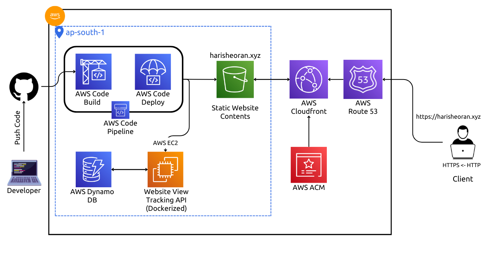

# AWS Full Stack Resume Project.
v1.0.0

- Developed a professional resume website hosted on AWS, utilizing various AWS services for robustness and security.
- Leveraged AWS CloudFront CDN for efficient content delivery and AWS S3 bucket for hosting static website content, ensuring scalability and reliability.
- Implemented HTTPS protocol for enhanced security, supported by SSL/TLS certificate managed by AWS Certificate Manager.
- Managed DNS with AWS Route 53 for seamless domain management and resolution.
- Engineered a view tracking API using Go language, integrated with AWS DynamoDB for efficient data storage and retrieval.
- Containerized the View Tracking API using Docker for streamlined deployment and scalability.
- Orchestrated deployment pipeline on AWS utilizing AWS CodePipeline, CodeBuild, and CodeDeploy for automated building, testing, and deployment of the API Docker image.
- Employed various AWS services including IAM Roles and IAM Users for secure access management and authorization.

# Infrastructue as Code using Terraform
Read Full documentation on my [website](https://harisheoran.github.io/projects/aws_resume_iac/).